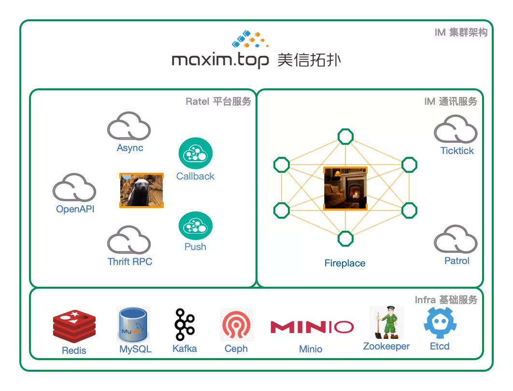
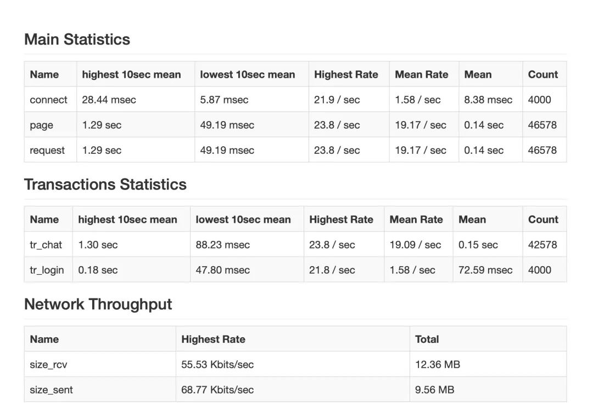

# 树莓派中的 IM 私有云支持多少并发？

原创 一乐 美信拓扑 _2020-04-07 11:20_

美信拓扑技术分享系列 0x01。关注「美信拓扑」微信公众号，第一时间阅读本系列后续文章，了解美信拓扑IM的协议、架构和源码。

**4000人同时在线，这是美信拓扑 IM 私有云的数据。**是的，只需要一个400块的树莓派4B。注意，这不是长连数据，是登陆且发消息的场景，详细性能数据见文后压测报告。

本文将会介绍美信拓扑IM私有云的架构，以及将其运行在树莓派上所做的技术改造，供私密通讯业务的开发人员参考，尤其适合在办公、家庭、工厂等受限网络运行的业务。

对技术人员来讲，树莓派是一个非常好玩的开发板，装了Linux系统更是如虎添翼，树莓派4发布后，知乎上有个帖子\[1\]，也说了不少开脑洞的想法。  

今天给大家介绍已经可以在树莓派中安装运行的美信拓扑 IM 私有云。除了安装程序 maxim.ctl \[2\]版本不同外，其他操作跟普通主机完全相同，试玩的同学可参照安装指南[十分钟安装一套即时通讯 IM 私有云](http://mp.weixin.qq.com/s?__biz=Mzg3NzEyMTc1OA==&mid=2247483681&idx=1&sn=6a5540d07cd0d449072902ef7e7e41f9&chksm=cf269890f8511186bc29b25ec84d1927f2733a14628c91d23ea580c11284a91f3d2bb3384507&scene=21#wechat_redirect)\[3\]。

今天主要分享「十分钟安装」和「树莓派适配」后面的技术实现。考虑到有些同学对树莓派还不太了解，我们首先介绍用到的这款树莓派。  

  

## 树莓派 4B

  

2019年6月24日，树莓派发布了第四代产品 Raspberry Pi 4。新一代开发板经过了从里到外的全面革新，得益于制程和架构的提升，4 代性能预计可比上代树莓派 3B+提升 2-4 倍。树莓派基金会（Raspberry Pi Foundation）称，这款设备可以提供「与入门级 x86 PC 系统相媲美的桌面性能」\[4\]。

**是的，熟悉的配方，更香浓的味道！**

1.5GHz 四核 64-bit ARM Cortex-A72 CPU；  
4GB LPDDR4 SDRAM；  
全吞吐量千兆以太网；

作为一个即时通讯服务，我们需要的不少，但是这些已经足够。所以我们在第一时间就入手，并开始了树莓派的适配。

**有了即时通讯 IM 服务，树莓派的使用场景就不仅局限于用来驱动硬件，甚至可以开发很多社交应用了，**比如：

在家里的时候，可以实现家人间的私密通讯，文件图片中转和共享；

可以写个小游戏，跟朋友进行本地的三国杀等等，当然如果你带着路由器出去，你甚至可以在大山里玩；

在小区物业部署后，门禁和住户之间的通讯系统，数据可以保留在本地，也没有额外的通讯费用；

办公室、工厂、车间等等所有使用安全网络的地方，也都可以。

**所有这一切，只需要一个 400 块钱的树莓派4B（4G版）和一个美信拓扑 IM 私有云。**让我们一起看看这个 IM 私有云的架构。

  

## 美信拓扑 IM 集群架构

美信拓扑致力于做一键启用多云架构的即时通讯云服务，其实核心就是在做两件事，一件事是上手即用，一件是私有云跟公有云架构统一。

这也就是说，十分钟安装的私有云不仅是只需要一台普通主机那么简单，重要的是，它跟亿级用户千万并发的公有云，是相同的架构，详情见下图：

美信拓扑IM集群共有15个服务（公有云每个服务都会有多个节点），他们是为高伸缩性设计的，完全分层分离的三类服务。  

1\. IM 通讯服务，包括长连接服务 Fireplace，发号器服务 Ticktick，巡检服务 Patrol；  
2. 平台服务 Ratel，包括分离开的平台接口服务 OpenAPI、内部RPC服务 Thrift、异步处理服务 Async（树莓派版被合并进了API服务）、回调服务 Callback、和推送服务 Push；  
3\. Infra 基础设施服务，包括数据库 MySQL、缓存/快速存储 Redis、队列服务 Kafka、文件服务 Ceph/Minio、高可用存储 Zookeeper、Etcd；

我们平常所见的简单的IM系统，特别是开源的IM，大多是单体服务，这种服务在用户量增长后如何伸缩是个大问题。同时，缓存、异步化往往也还不够彻底，在不同业务的适配不够灵活，性能容易遇到瓶颈。

而云服务本身要照顾到亿级用户，千万级并发的请求，为了峰值增加队列，为了性能增加缓存，通常拆分得非常细致。但这样的服务在私有部署的时候就是一个大麻烦。

过去相当长的时间里，对各个云服务厂商来讲，安装调试都是一个高成本的工作，经常需要几个人的专业团队耗费几天时间才能完成。这也直接导致了云服务厂商私有部署价格普遍偏高，基础版的行业价格也在二十万以上。

**当然，问题关键还是如何把大象装进冰箱，解除困扰实施团队的魔咒。**

幸运的是，借助云原生技术的快速发展，特别是 docker 和 k8s 的逐渐成熟，我们终于可以打造一个真正企业级水准的 IM 私有云，这便是美信拓扑 IM 做十分钟安装的私有云的技术靠山。

那么，如何把大象装进冰箱里呢？

  

  

## 十分钟安装的私有云

  

把美信拓扑IM云装进一台主机，我们主要做了三件事：

1\. 把 IM 云服务进行云原生改造，容器化之后进入 Kubernetes；

2\. 把镜像注册到 Docker-Registry，自己建的用 Harbor 即可；

3\. 创建安装程序，处理程序的初始化工作，建 Kubernetes 集群并进行镜像拉取和服务启动；

如前所述，整个云服务设计服务众多，整体包尺寸会达到 3-4G，这样的数据包如果在自建的下载中心下载，大概需要 1-2 个小时，更别提网速和带宽消耗了，这个事情做过下载站的朋友应该更了解。

好在阿里云现在做了镜像托管服务 ACR \[5\]，不仅提供公开的下载，速度非常的快。感兴趣的可以了解下，暂时这个服务是免费的。如果没猜错的话，服务应该已经用到了 Dragonfly \[6\] 的 P2P 下载技术，实测基本可以跑满下载带宽。

再加上把服务分级之后做的基础镜像合并，整个下载时间就被控制在了十分钟以内，安装的大部分时间消耗解决了，剩下的程序启动时间就少多啦。

当然，十分钟这个时间还是很有挑战的，因为服务安装完启动需要自动配置。如果公有云上有数据，也会将原有数据自动迁移到本地，完成数据初始化。

安装结束后，外部健康检查会进行系统巡检，通过后会自动更新DNS切换集群，最终完成私有云的上线，这时候使用「美信拓扑IM」DemoApp就可以扫描二维码直接使用啦。

按照之前所述，本地安装的私有云跟公网的公有云集群都是同架构的对等集群，相信你还会很开心地发现，本地私有云服务配置依然可以通过线上的控制台，包括创建用户、管理群组、设置回调、配置证书等。

不过这些都属于多云架构的设计，咱们以后有机会再展开讨论。

Tips：在国内安装k8s，要记得修改 DNS 服务器。

  

  

  

## 适配树莓派

那再如何把大象装进盒子呢？

由于树莓派安装的也是 Ubuntu 操作系统，所以适配工作其实很简单，主要有以下几件事：

1\. 操作系统启用 cgroup，设置后记得重启：

    sed -i 's/$/ cgroup_enable=memory cgroup_memory=1 /g' /boot/firmware/nobtcmd.txt reboot

2\. 为树莓派单独打包镜像，因为树莓派CPU是 arm 系列：  

先确保 Docker 版本不低于 19.03，使用如下命令启用 buildx 插件，并从默认的构建器切换到多平台构建器

    export DOCKER_CLI_EXPERIMENTAL=enabled

再使用buildx构建镜像并push  

    docker buildx build -t test/hello --platform=linux/arm64 . --push

3\. 减少CPU和内存消耗，毕竟原来主机的时候内存是 8G，现在只有 4G：

    修改 Kafka topic 的 partition 数量；

当然，上面的改造仅为分享参考，美信拓扑 IM 私有云相关的所有操作已经在安装程序 maxim.ctl 中自动完成，并不需要人工干预。  

  

  

  

## 性能怎么样？

  

按照服务端开发正常惯例，服务完成当然进行性能的确认，压力测试必不可少。  

测试还是要请老朋友 Tsung \[7\] 。Tsung 是一个 Erlang 写的非常非常非常好用的性能测试框架，可以测XMPP、HTTP、LDAP等很多协议，链接是我们维护的仓库分支，这里一并推荐给大家。

当然对于我们自定义协议的即时通讯系统来讲，肯定写了自己协议相关的插件，暂时就保密啦。

先看吞吐（Throughput）数据。

1. 连接和请求速率：

2\. 登录和聊天速率：  

3\. 网络流量情况：  

总体连接情况呢？看下图。

这条曲线，相信做过服务端的同学都会泪流满面。连接曲线和统计曲线重合在一起，意味着所有请求都被即时地处理了。

这可是性能压测的梦想曲线！✌️

也就是说，压测结果显示树莓派中运行的美信拓扑IM，可以达到 4000 并发，在登陆且聊天的场景下，情绪非常稳定。

整个压测期间，平均登陆时间为 72.59ms，最长登陆时间 180ms，最短 47.80ms。

你猜对了吗？

那再留个小问题，猜一下，一台普通 4C8G 云主机，能撑多少人呢？ :P

注意：我们今天压测的场景是登陆且发消息，而不仅是挂长连接，如果大家要进行指标对比，一定要分清楚，这是很多初学者，甚至有些厂商也会故意混淆的数据。只是挂长连接的话，数据会有数量级上的差别。

  

## 后记

这是美信拓扑技术分享系列的第一篇 0x01。如果你喜欢，欢迎关注公众号「美信拓扑」，后面会有关于「美信拓扑IM」相关的协议、架构、源码方面的文章继续分享。  

  

**做个手艺人吧！一起玩树莓派**

  

  

4.18号周六下午三点，我们在B站有 Workshop 直播，大家一起安装树莓派，玩 IM，一起来呀。 

  

点击查看原文，或者复制链接进入 https://live.bilibili.com/22069399

  

Workshop 期间，可以一起聊聊天，关于程序员、架构师、技术、管理的一切问题随意聊。

  

如果你有好玩的树莓派有关的好玩具，也欢迎来连麦分享。

  

## **引用**

1、树莓派4怎么样，可能的玩法有哪些    知乎  
https://www.zhihu.com/question/331141310  
2、美信拓扑私有云树莓派版本  
https://www.maximtop.com/downloads/  
3、[十分钟安装一套即时通讯 IM 私有云](http://mp.weixin.qq.com/s?__biz=Mzg3NzEyMTc1OA==&mid=2247483681&idx=1&sn=6a5540d07cd0d449072902ef7e7e41f9&chksm=cf269890f8511186bc29b25ec84d1927f2733a14628c91d23ea580c11284a91f3d2bb3384507&scene=21#wechat_redirect) 美信拓扑  
4、树莓派4正式上线！「PC级」性能，支持4K双屏，仅售241    机器之心  
https://www.jiqizhixin.com/articles/2019-06-25  
5、阿里云镜像托管服务  
https://cn.aliyun.com/product/acr  
6、深度解读阿里巴巴云原生镜像分发系统 Dragonfly    阿里云  
https://yq.aliyun.com/articles/670136  
7、Tsung is a high-performance benchmark framework for various protocols including HTTP, XMPP, LDAP, etc.  
https://github.com/maxim-top/tsung  
8、美信拓扑私有部署安装指南  
https://www.maximtop.com/docs/install\_maxim/  
9、How to install Ubuntu on your Raspberry Pi  
https://ubuntu.com/tutorials/how-to-install-ubuntu-on-your-raspberry-pi
