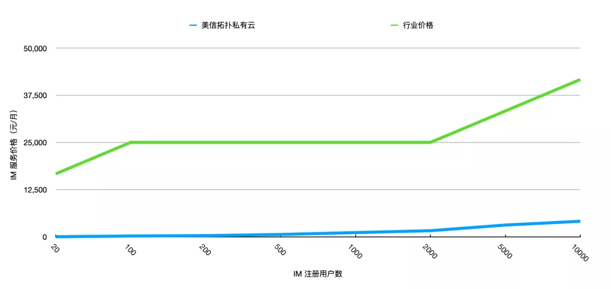

# SaaS定价二：按月付费的私有云

原创 一乐 美信拓扑 _2021-07-02 10:34_

> 收录于话题
>
> \#IM云服务4个
>
> \#选型3个
>
> \#SaaS定价3个
>
> \#即时通讯5个
>
> \#美信拓扑7个

SaaS 模式的核心是什么？不讲武德！

**这是关于 IM 云服务定价系列文章的第二篇，如果你要正在选型，这篇文章值得你阅读。**

如果你也在做 PaaS/SaaS 服务定价，这篇文章也许会对你有所启发。

作者 | 一乐

编辑 | 艾姆姐

[上一篇文章](http://mp.weixin.qq.com/s?\_\_biz=Mzg3NzEyMTc1OA==\&mid=2247483807\&idx=1\&sn=bbe9743663db23b75f7c5bbe95b08ca0\&chksm=cf26982ef85111382dc91709df3fafc91f835f1372a415ef79e5b864cb14d6cfed2780367b55\&scene=21#wechat\_redirect)我们讲的是公有云，本篇文章作为 SaaS 定价系列的第二篇，我们主要讲私有云。跟之前一样，还是先讲价格，再讲背后的设计思想。

前文提到，当前一套 IM 私有云的行业价格基本为 30 万起。而美信拓扑的 IM 私有云，在 100 人规格的情况下定价仅为 199 元/月，因此我们说价格按年费计算，也不及行业价格的百分之一。

有朋友开玩笑道，你这是不讲武德！

我只能说，对不起，我们也是没办法，毕竟技术太好不是，哈哈哈哈。

开个玩笑，其实如果你知道在价格对比时我们已经手下留情的话，可能就不会这么说了。因为我们还没有强调按月费用的意思是可以按月支出，也没有提规格可以随时调整意味着在用户量没上来的时候先用小规格，花更少的钱。

考虑到 IM 产品的常规研发周期之长，这部分优势只能说是很大，非常大！

为了直观，还是上一下图表：

## IM 行业价格对比：私有云

上图是 0 到 1 万用户区间价格对比，全部用户（ 0 到百万用户区间）见下图：

需要注意的是，以上两图中行业价格均已按月折算，但在实际情况下，传统私有部署通常会按照项目方式运作，从项目开始、上线到验收进行分阶段款项支付，并不支持按月付费。

图中美信拓扑价格数据都是公开的，可到以下页面查看最新价格和优惠：

> 美信拓扑 IM 定价
>
> https://www.maximtop.com/plans/

下面开始讲私有云背后的思考与设计，主要从三个方面展开：

1. 私有云是什么？
2. 为什么需要私有云？
3. 私有云的成本以及定价

## 私有云是什么？

“免费版、专业版、旗舰版、商业版、

公有云、专有云、托管云、私有云、海外云”

你知道这些术语代表什么吗？

过去一段时间，云服务商们绞尽脑汁做了一件事，就是如何尽量在不犯专业错误的基础上，用更华丽的术语吸引用户。但由于这种「尽量」仅限于公开资料，而很多解释都是由销售人员来做，或有意或无意的引申，让客户很容易混淆这些名词。

私有云是个最有意思的例子。因为在云服务刚刚兴起的几年里，说到云就是公有云，压根儿没有私有云这个说法。但是受限于公有云的渗透率，很多云服务公司迫于营收压力还是会做一些项目。这样的项目都是以私有云的名义，实际上交付的只是一个公有云服务的独立部署版本，阉割了租户系统和控制台而已。

今天你看到的很多公司依然还是这种交付方式，但这种方式非常低效，而且陷入了跟众多传统技术服务公司竞争的局面，却没有任何优势。成本问题我们后面分析。

直到2019年12月，作为云计算龙头的 AWS 正式发布 Outposts \[1]，才真正将私有云推到业界面前。当然我们知道在此之前很早时间 2017 年，微软就发布了自己的混合云框架 Azure Stack \[2]，但受限于云原生技术的发展，行业里对私有云和混合云的应用远远没有开始。

是的，你也看到了，这两者都在重点宣传混合云在不同场景下的一致性管理体验。也就是说，私有云应该有跟公有云一致的体验。而这种体验，不仅是具体产品体验，还包括服务的管理和控制。

这也是我们区分私有云和传统的私有部署软件的关键，为了更好地理解这一点，你也可以试着思考下 Office 365 和 Office 2019 的区别。

**真正的私有云，应该是满足用户产品功能需求和私有需求后，让用户可以像使用公有云一样使用。**

公有云的按需扩容缩容，私有云也要能做到；公有云有的开通定制服务的控制台，私有云要有；公有云有的自动服务巡检与健康检查，私有云也要有；更重要的是，订阅式的费用支出方式，私有云也能够支持。

但如果用户就像用云，为什么不用公有云呢？或者换个角度，为什么还要用私有云呢？

## 为什么需要私有云？

我们处在一个云服务快速扩张的时期，Gartner 在前几天（2021.6.28）发布了最新报告\[3]，2020年 IaaS 市场的增速依然高达40.8%，更别提 PaaS 和 SaaS 了。整个市场的客户支出预计在 2021 年也会保持 23% 的增速\[4]。

因为这令人欣喜的增速，加上在 2019 年前主流云厂商都旗帜鲜明表态说私有云并非真正的云，因此有不少人乐观地认为，公有云会逐渐替代传统的 IT 设施，而私有云市场注定要被蚕食。然而越来越多的数据表明，即使排除中美市场的差别，私有云的需求依然明确而强烈。

这一方面由于用户上云并不是一朝一夕的事情，而混合云技术的发展已经能够让用户最大程度利用公有云的好处，同时又保持部分业务的私有性，上云不再是个二选一的决策，因此他们对云的接受度大大提高。

另一方面，私有云的真正实现，也能够在保证用户私有需求的情况下，给用户提供有公有云一致的体验，原有项目传统私有部署项目的升级替代效应明显。

混合云技术和多云模式的完善，让公有云和私有云彻底告别了此消彼长的关系，而是一种新型的共同创造市场增量，共同升级 IT 市场的关系。这也是为什么越来越多的 IaaS 厂商也开始将混合云的支持提升到了战略水平，其中包括支持混合云或多云架构的上层云服务应用 \[3]\[5]。

根据过去的实践看来，应用层面对私有云的需求至少有以下几种：

1.  **数据安全/隐私/合规**

    公有云毕竟是个租户共享的平台，只能为所有用户提供同样的数据安全和保护措施，而在某些场景下，数据需要有更高的安全措施，比如额外的审计和网络控制，或者更进一步，根本就不希望数据在云端流转。

    更大的层面，数据主权的浪潮下，各国在数据方面纷纷出台各种法规，或者限制数据流出管辖区域，或者限制其留在特定的 IDC。企业为了业务开展必须满足这样的规定。

    以上都是以数据存储决定的私有化需求。
2.  **计算效率**

    随着大数据和人工智能技术的发展，每一个数据算法需要访问的数据越来越大。是把大量数据传到云端计算，还是把计算模型推送到数据产生端，计算后再将结果回传，是一个选择，也是一个计算效率问题。

    不过网络的发展赶不上数据制造速度是显而易见的问题，因此更多利用本地计算而不是网络传输加云端计算也是一笔重要的成本账。在此之外，如果计算结果是在本地展现，本地计算也明显会有更低的延迟。

    以计算效率为目标的私有化需求，会在即将到来的万物互联场景中更加强烈。
3.  **全球/出海应用**

    公有云并不能覆盖到全球各地。强大如 AWS，在扩展到全球各地的时候，也要依赖于更基础的水电网络等设施，都会受限于区域经济发展。此外，经济发展也会限制 IT 应用的数量，而公有云是利用规模效应来获取价值的，没有足够的应用，公有云期望的投入产出比就不能满足，也因此比如限制其扩张。

    但这并不代表这个区域没有云服务需求，只要有用户有需求，就有公司需要开展业务。采用云服务比起从零构建所有模块，不仅省下了业务启动的时间，也会大大降低运营成本，这对所有企业都是非常有吸引力的。

    这也是以区域可用性为目标的私有化需求，是很多出海企业的选择。

这些需求，尤其是最后一个，你会发现成本永远是重要的因素。私有云除了在产品体验上要提高，成本上也必须比传统私有服务项目有明显的优势才行。

因此，如何优化服务成本并合理定价，便成了私有云业务开展的重要因素。这是我们下文即将讨论的，本文的重点。

## 私有云的成本以及定价

从服务提供者的角度来看，传统私有部署项目的成本主要有三部分：

一是商务成本，即销售人员通过商务拓展并维系客户的投入；

二是软件成本，主要是研发项目相关软件所需的费用，由于其项目性质，大多数情况产品都是定制的，复用度非常低；

三是服务成本，即在客户服务器上部署软件并调试的实施成本，和实施后的维保成本；

当云服务公司开始开始做私有部署，由于本身也是为了满足大多数客户而设计，软件复用程度高，因此第二项软件成本是大幅降低的，主要是授权费用。与此同时，又因为云服务本身是为了承载更高量级的客户，架构设计与服务拆分又会带来私有部署时的复杂性，第三项服务成本又会有所增加。

因此从整体上看来，其成本与传统软件公司相当。虽然软件有更华丽的名词，相对好的质量，但基本上还在同一维度竞争，主要竞争也发生在商务层面。

而支持多云架构的云服务软件，在降低软件成本的基础上，服务成本大幅降低，像我们美信拓扑这样的 IM 软件，安装部署就像安装 Office 软件一样简单，[十分钟即可安装完毕](http://mp.weixin.qq.com/s?\_\_biz=Mzg3NzEyMTc1OA==\&mid=2247483681\&idx=1\&sn=6a5540d07cd0d449072902ef7e7e41f9\&chksm=cf269890f8511186bc29b25ec84d1927f2733a14628c91d23ea580c11284a91f3d2bb3384507\&scene=21#wechat\_redirect)，系统也可以自动测试并巡检。比起传统私有部署动辄几十人日的部署调试时间来讲，体验上是质的提升，成本也是数量级的降低。

进一步针对我们要目标的中小企业客户，销售策略是在线营销为主，因此商务成本也可以大幅降低。如前所述，整体成本的降低给了我们极大的定价灵活性，当我们定价降到十分之一甚至是百分之一的时候，**那些有商务关系能拿到项目的技术服务商，就可以有 90% 以上的利润空间**。

当然，定价不能只从成本来看，我们还要看客户的真正的支出。

从客户的角度来看，私有云是要看 TCO 的，虽然这是很多企业在采购决策时会遗漏的地方。使用私有云涉及三部分成本，首先是软件项目费用，这是前面讨论的项目费用；其次是硬件及网络成本，即运行软件所需的资源；最后是人力成本，为保证服务正常运行，需要专业的技术人员对软硬件进行定期的维护。

但由于项目制的特点，从预算规划开始，第二项里硬件及网络都就会预留出来以满足最终需求，因此这部分资源成本在实际项目中占比会相当之高，甚至高出软件费用本身也是常有的事。

我们在私有云定价时也充分考虑了客户的总体支出。当前**定价的总体原则是，提供与行业公有云相当的价格，同时让客户的私有云 TCO 大幅降低**。

如图所示，我们美信拓扑的私有云定价已经基本与行业公有云价格基本相当，TCO 也远远低于传统私有部署。

当然，如果看了第一篇文章你就会知道，实际上美信拓扑的公有云要更低一些，原因前面已经解释过，而当前这个行业公有云价格其实更接近我们美信拓扑专有云的价格。不过后者的具体定价，等我们下一篇再讨论。

## **备注**

本文讨论的云服务和私有云，总体上包含了 IaaS、PaaS、SaaS，但在不同章节时指代稍有不同。比如在讲发展趋势时以 IaaS 平台为例，在项目分析时则以 PaaS/SaaS 为例。前者主要是考虑到一般公开的数据和报告，都是以 IaaS 服务为主，方便读者在阅读过程中掌握真实的信息，同时 PaaS/SaaS 服务的技术升级虽然会稍晚一些但趋势是相同的。而后者，则是尽量结合我们当前的业务，希望作为业内最早一批支持多云架构的云服务，为读者带来业界最真实的分析和解释，供参考。

## **引用**

1、AWS Outposts \
https://aws.amazon.com/cn/about-aws/whats-new/2019/12/announcing-general-availability-of-aws-outposts/\
2、Azure Stack Timeline\
https://www.itprotoday.com/iaaspaas/azure-stack-timeline\
3、Gartner Says Worldwide IaaS Public Cloud Services Market Grew 40.7% in 2020 \
https://www.gartner.com/en/newsroom/press-releases/2021-06-28-gartner-says-worldwide-iaas-public-cloud-services-market-grew-40-7-percent-in-2020 4、Gartner Forecasts Worldwide Public Cloud End-User Spending to Grow 23% in 2021\
https://www.gartner.com/en/newsroom/press-releases/2021-04-21-gartner-forecasts-worldwide-public-cloud-end-user-spending-to-grow-23-percent-in-2021 5、Cloud Computing Market Size, Share & Trends Analysis Report \
https://www.grandviewresearch.com/industry-analysis/cloud-computing-industry

关于美信拓扑

\*\*美信拓扑，\*\*一家很酷的技术公司，他们研发的一键启用多云架构的即时通讯云服务，具有超强的伸缩能力，可以支撑从亿级用户千万并发的公有云服务，到一台主机十分钟安装完成的私有云。目前各种组件正在陆续开源。

**特别提示**

点击原文，去微博关注美信拓扑并转发此文章，7月份会抽10名送美信拓扑「私有云 1 万用户使用券」哦。

继续关注「美信拓扑」，了解一键启用多云架构的即时通讯。

