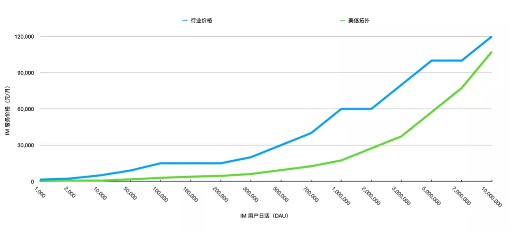

# SaaS定价一：每月￥199的 IM 云服务

原创 一乐 美信拓扑 _2021-06-24 22:00_

> 公有云服务价格再次降到八分之一，私有云的价格降到百分之一，这个价格很疯狂？不！
>
> **这是一篇关于 IM 云服务价格的文章，如果你要正在选型，这篇文章值得你阅读。**
>
> 如果你也在做 PaaS/SaaS 服务定价，这篇文章也许会对你有所启发。

作者 | 一乐

编辑 | 艾姆姐

美信拓扑 2021 版的价格上线了，公有云价格继续降低，变成了行业价格的八分之一，而私有云呢，这是一道相对复杂的算术题：

一套软件，原价卖 30 万，现在卖 199 每月，它的价格是是原来的多少？

是的，即使按年费来看，也是百分之一，不到！惊不惊喜意不意外？！

本文是 SaaS 定价系列文章第一篇，主要讲公有云定价，私有云内容请见第二篇。如果你正在进行选型 IM 云服务，想要了解定价相关的内容，可以阅读每篇第一部分，如果你也正在参与 SaaS/PaaS 相关业务，建议阅读全文了解定价背后的思考。

先看一个公有云价格。

现在 IM 云服务行业定价方式是按照日活用户（DAU）数量，具体操作一般以每月第三高日活以避免 APP 用户异常波动带来的费用急剧变化。以 1000 日活用户看，行业价格每月 1500 元，美信拓扑公有云是 199 元。

当然还是图片来得更加直观：

## IM 行业价格对比：公有云

上图是 0 到 10 万日活区间价格对比，全部日活（ 0 到千万日活用户区间）见下图：

以上图中价格数据都是公开的，可到以下页面查看最新价格和优惠：

> 美信拓扑 IM 定价
>
> [https://www.maximtop.com/plans/](https://www.maximtop.com/plans/)

你觉得这个价格怎么样？

当定价公布后，我问了一个行内同样做企业服务的朋友。他回答说，好像很多企业客户并不在意价格，更重要的是商务关系和品牌。如果是政府项目，人家在意的规避风险或者不会犯错。

我部分同意他的观点，尤其是我也知道他们服务过招商银行、政府央企等大客户。

商务关系强的客户，可以让价格根本不是一个决策因素。预算制的客户，预算制定完后的工作重点是如何有效且完整得将所有钱花出去。组织关系复杂的客户，CTO 更在意的是不会犯错，而不是选用对企业最经济的方案。

当然，还有更多的原因让 CTO 不在意价格，待后面单独文章讲。

他只是还不知道，在我们心中，这部分所谓的客户并不是我们的目标客户。

## 价格决定客户

我曾经在《云服务的下一个十年》一文讲过，为什么云服务能够替代到传统 IDC 服务商：

> 实现云服务的技术，提高的是技术服务的效率。作为业务系统的倍增器，降低服务交付的边际成本，为规模化带来了可能。原来你只能服务几家客户，现在却可以服务几十万家，甚至百万千万家。
>
> 而新的这些客户，原本可能并不会也没有预算来尝试使用服务。
>
> 一乐，公众号：一乐来了[云服务的下一个十年](../Industry-development/the-next-decade-of-cloud-services.md)

云服务的价值，在于将服务成本降低到比原来低一个甚至数个数量级，然后激发上层应用的繁荣，最终从应用和市场的成长中获益。

也正因此，虽然我们有理由相信所有客户最终都会选择我们，但现阶段，以下几类客户显然更愿意选择我们，他们是：

1.  项目外包团队

    他们是乙方，是服务提供商，是系统集成商。他们有着与最终客户超强的商务关系，也可以做基于 IM 功能之上的二次定制与开发。当客户预算确定后，他们将项目整包下来。但由于 IM 功能开发的复杂性，他们自行开发一个这样的系统并不划算，所以会采购已有的成熟 IM 云厂商产品，并以此基础来完成项目交付。

    外包行业整体利润率约在 10% 不到，如果他们选择我们的服务，可以在 IM 项目上比选择其他竞品多出 80%-90% 的利润。
2.  以 IM 为核心的垂直领域产品

    以 OA 协同办公市场为例。虽然由于钉钉、企业微信、飞书等云厂商的进入，竞争已经越发激烈。但这个行业整体上仍然分散，市场集中度较低，感兴趣的可以查看 2021 年《中国协同办公市场研究报告》。

    协同办公软件中 IM 已经成为标配，用户对 IM 体验要求也日渐提高。但相当数量的中小软件开发商，并没有能力支撑一个 IM 开发团队，选用 IM 云厂商的私有部署动辄 30 万起步的行业价格，又让他们无路可退。

    如果他们选用美信拓扑 IM 私有云服务，可以以原来价格 1% 的支出获得专业的 IM 功能。如前所述，100 人规格私有云支持按月付费，每月 199 元，也就是每用户每月不到 2 元，这对 OA 厂商以用户计价的产品是非常友好的。
3.  初创企业

    初创企业现在的范围很大，很多接近上市的公司还经常称自己初创企业，毕竟需要融资的企业都可以说自己没有足够资金且「刚刚」成立。所以我们还是有必要明确一下，这里说的企业是那些刚刚成立，CEO 或创始人因为在意成本，还会参与技术和服务选型的企业。

    这个范围限制你可能稍微惊讶，但其实很简单。在稍微大一些的企业，因为分工细化，成本控制和产品研发很容易被割裂，后者是 CTO 的事，前者则留给了 CEO。这就导致成本在技术选型中很容易被忽视，虽然我们期望一个合格的 CTO 给出最优的 IT 支出方案，但考虑到现代业务的复杂性以及企业的快速发展，其不可避免的会遇到各种困难挑战甚至犯错，这就会促使其经常会做保守的选择。

    也就是我们经常发现的，有 CEO 参与的初创企业往往会选择我们，因为即使综合各种因素，我们的价格优势都是巨大的，足以因此为企业增加更多的试错机会，这在初创企业的业务探索期是非常宝贵的。
4.  出海企业

    确切地说，是在云服务建设尚不发达的地区开展业务的公司，这里的云服务是阿里云、AWS 这样的 IaaS 服务商。

    阿里云、AWS 虽然已经在拓展全球业务，但还是有一些地区并不能有足够的服务器和网络覆盖。在这些地区开展业务的企业，或者选择其他云服务商，或者只能自己搞定服务器机房资源。

    在以前的时候，他们只能选择私有部署方案，往往价格很高维护又很复杂，而现在，他们可以在其他云服务商上选择我们的专有云，或者在自己的服务器上部署我们的私有云，美信拓扑的这两种服务，都支持订阅制，按月付费，且价格很低。

    私有云前面已经说了，在小规格上年费可以达到百分之一，而专有云，基本上已经到了行业公有云的水准，这个等后面专门介绍。

总而言之，上面这些客户，他们会更在意自己的 IT 支出，尤其是在当前经济条件下。

而他们也有个共同的名字，叫中小企业。

我们愿意做的就是给他们支持，让他们赚到钱，让他们的业务更好的开展。这个支持，就是变我们的技术优势，为成本优势，降低他们的 IT 开支。

所以我们并不是在做慈善，我们只不过是相信这种成长会带来需求的倍增。

当然，从根本上讲，还是我们架构和技术的升级使得我们有成本上的巨大降低，这种优势，最终为我们提供了定价上的灵活性。

你可能会问，既然要支持，为什么不好人做到底，直接免费呢？

## 不，不能免费

> 她那时候还太年轻，不知道所有命运赠送的礼物，早已在暗中标好了价格。

这是茨威格给玛丽皇后写自传时的一句话，被很多人所熟知，用在这里最合适不过了。

互联网业务最熟悉的套路，就是羊毛出在狗身上，猪来买单。

微博、微信、头条都是这种模式，他们是给终端用户（2C）使用的App，所以很多人了解。而企业服务里也有类似案例，举两个例子：

1.  推送服务。现在你选的很多第三方推送都有免费版，而他们的另一个重要业务，就是广告推送。通过收集接收推送的用户隐私数据，对用户进行画像，然后进行精准营销。

    他们能够做成这一步，跟行业发展阶段有关系，在监管尚不完善，市场相对混乱的时候，很多企业和用户还没有数据所有权的概念，用户数据被收集走，成了广告闭环中的一环。
2.  餐饮 SaaS 服务。现在很多做餐饮 SaaS 的平台，为商家做各种工具，从收款、订单管理到会员管理，一应俱全，却并不收商家的软件使用费。

    很多商家还用得很开心，殊不知自己的流水数据早就被平台一览无余。重要的是，支付平台因为需要抢占用户，提升自己作为支付入口的把控能力，将这样的平台作为触达用户的工具。所以，你仔细分析就会发现，免费不过是一起被放到了更大的案板上而已。

IM 云服务是走过这条商业弯路的。但是受限于聊天数据的敏感程度，没有理性的用户愿意自己的聊天内容被用在广告系统里，也没有企业客户愿意冒这样的风险，把这种数据作为羊毛交出去给一个平台服务提供商。

如果狗身上薅不出羊毛，如何养狗就成了问题，狗和人都有可能被标上价格。

至少，平台也是要生存的。

有朋友可能也看到，我们美信拓扑是有免费版可以用的，公有云有 100 人用户的免费版，私有云有 20 人规格的免费 License，所以还是要多说一句，他们不过是为了开发和测试方便而设置的。

## 后记

市场活动中，你永远不知道用户会有什么反应。

今年 2021 的价格调整，我们同时也为老用户降了价。然后就有一个朋友发来信息问，老用户还降价，你们是不是不行了？听得我一脸黑线。。

我说朋友，其实降价完全可以只针对新用户，我要是不行了为啥还是有钱不要呢？

我们统一降价的目的，是希望不管新老用户都能得到舒心公平的价格，不必因为买得早而后悔。就像我们也并不去选择高价格大折扣的套路，说到底都是效率，不过这一回是商业效率。

云服务不是奢侈品，而是企业的消费品。给客户一个无法拒绝的价格，让更多人快速决策用上可靠的服务，才是我们值得追求的。

### 相关介绍

**美信拓扑**，一家很酷的技术公司，他们研发的一键启用多云架构的即时通讯云服务，具有超强的伸缩能力，可以支撑从亿级用户千万并发的公有云服务，到一台主机十分钟安装完成的私有云。目前各种组件正在陆续开源。

### **特别提示**

点击原文，去微博关注美信拓扑并转发此文章，7月份会抽10名送美信拓扑「私有云 1 万用户使用券」哦。

继续关注「美信拓扑」，了解一键启用多云架构的即时通讯。

