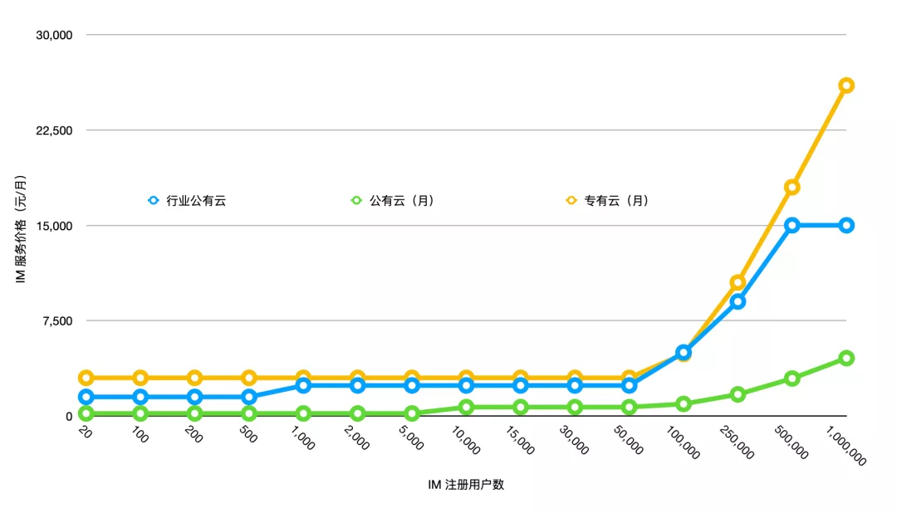
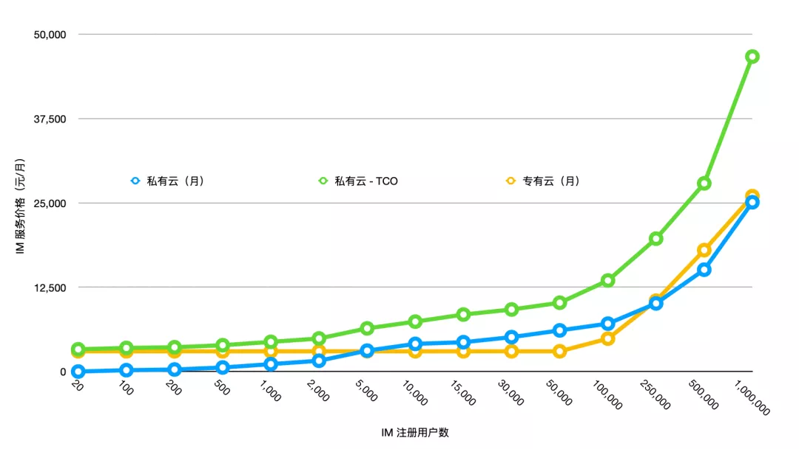
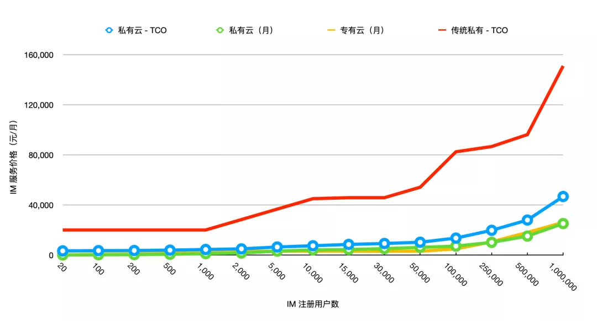

# SaaS定价三：没有邻居的专有云

原创 一乐 美信拓扑 _2021-07-19 16:23_

> 遇到吵闹的邻居怎么办？这是租户的困扰，也是服务的问题。
>
> **这是关于 IM 云服务定价系列文章的第三篇，如果你要正在选型，这篇文章值得你阅读。**
>
> 如果你也在做 PaaS/SaaS 服务定价，这篇文章也许会对你有所启发。

作者 | 一乐

编辑 | 艾姆姐

前天看到一则新闻，在上海浦东新区的一个小区的震楼暗战终于告一段落。此前近五年里，这栋名为「关爱楼」的绝大部分住户的生活被震楼器搅得寝食难安。原因在于一个漏水问题沟通未果，502 室住户买来震楼器，用噪声攻击了全楼住户。

如果你还不知道震楼器是什么，可以去各大电商平台搜索，不搜也没关系，你肯定知道睡觉时邻居忽然装修的滋味，震楼器的效果可以比这更强。

这个吵闹邻居（Noisy Neighbor）问题，便是公有云服务质量的第一考验。

大家都知道，公有云是多租户共享资源，所有上层应用使用的是同样的底层资源。一般设计云服务，功能之外就是设计多租户体系，然后在上线前完成容量评估，看看会有多少客户多少用户来，做与之匹配的性能压测和服务优化。

很多服务就这样上线了，就像我们几年前一样。带着一身随便你用的慷（tian）慨（zhen）气势，API 接口随便调，用户随便注册，消息随便发。

结果很快就被教训了，震楼器用户层出不穷。有的用户为了测试服务性能，建了测试应用，大量调用导致 API 服务器 503，登录获取信息等接口大量失败；有的用户则大量发送消息，堵塞了整个集群，消息发送延迟急剧增加。而后者又会引发严重的队头堵塞（HOL blocking）问题。

一系列操作下来，我们服务的 SLA 直线下降，而且每次事故处理都需要大量的人力和时间。毕竟在服务刚搭建完的当时，不仅架构上还有不少改造要做，运维设施也并不完善。临时扩容、解决堵塞、定位问题租户并针对性封禁，这一系列操作都必须在限定时间内完成，而缺失工具的改造也必须在当天完成以免再次遇到同样的问题。

这些教训和经验在之前的演讲中也多次分享过，细节不再赘述。虽然直到我们将所有 API 接口以及消息逻辑进行了限制才根本上解决问题，但远水接不了近渴，当时我们最有效的措施，仍然是分离重要客户与普通客户。

将业务稳定且付费能力强的客户转移到专门的集群，这个集群便是后来所谓的「VIP集群」。

从架构模式上看，这便是所谓的基于空间的架构。很多云厂商的「行业专有云」，都是这个模式。虽然空间分离了，但每个空间依然是多租户的，这就意味着在空间内资源依然是共享的，因此吵闹邻居的风险依然存在。

真正解决这个问题，只有将资源彻底的隔离，保证客户对资源的独享。这只有两种方式能够做到，或者是独享的公有云，或者是托管的私有云。

因此定价方面，我们要考虑的是专有云比公有云多出来的资源独占成本，以及比私有云多出来的运维托管成本。

看图更直观：

## IM 价格：专有云 vs 公有云

由于独立集群有初始资源占用，美信拓扑专有云（黄线）在起步价格上是高于行业公有云的。进一步，由于服务性能高，资源利用率得到了很好的控制，因此很快在 1000 日活档之后即保持了跟行业公有云相当的价格。

也就是说，**使用美信拓扑专有云，你可以用公交的价格享受专车的服务**。

你可能注意到了，这里并没有与专有云行业价格进行比较。主要是因为当前市场上普遍缺乏成熟的专有云产品。有的公司看似提供却由于是项目制运作，没有标准定价，价格也必然无法跟真正的云服务对齐。

这也是我们提多云架构的原因。因为如果不是多云架构，没有针对性的多集群架构支持，没有统一的控制台，没有自动化的运维管控体系，一个团队能够管理的云是有限的，成本只会比传统私有云还要高。

## IM 价格：专有云 vs 私有云

在前面文章里，我们分析过私有云的 TCO 成本，这里也主要用它来跟专有云比较。可以看出，在起步成本上两者相当，随着用户增长，美信拓扑专有云（黄线）的价格比起私有云 TCO 的优势也开始逐渐扩大。

这个优势是由于服务标准化专业化带来的，因为随着用户规模增长，使用私有云的客户，运维成本也会逐渐提高。

而如果与传统私有云 TCO 对比来看，美信拓扑专有云（黄线）的优势则更为巨大：

图中美信拓扑价格数据都是公开的，可到以下页面查看最新价格和优惠：

> [美信拓扑 IM 定价](https://www.maximtop.com/plans/)

以上就是我们在专有云设计与定价的一些考虑，也是 SaaS 定价系列的第三篇，前两篇分别是《[SaaS定价一：每月￥199的 IM 云服务](saas-pricing-one-im-cloud-service-of-199-per-month.md)》《[SaaS定价二：按月付费的私有云](saas-pricing-two-monthly-private-cloud.md)》，可一起参考阅读。

## 后记

最近直播带货很多，很多都在重复使用过去电视购物的套路：

> “你会为这样一把刀具出多少钱？”金厨广告的播音员问，“在回答之前，请先听听：它送一把配套的叉子，锋利无比，能帮你把切菜变成享受。别急，还有很多其他的……”接下来，播音员抛出一套“六合一厨房工具”，一套“牛排用刀”，还有一柄“独特的螺旋形切片刀”。
>
> “广告播到最后，”金厨的合伙人之一，埃德·范伦蒂（EdValenti）说，“你都搞不清自己得到了哪些东西，可你知道，它花不了几个钱。”
>
> 《无价》《Priceless: The Myth of Fair Value》

是的，在这种地方，你唯一买不到的一件东西，就是单纯地只买一件东西。

这个套路的设计，依靠的定价心理学里一个重要的观察，即**意外之财的实际金额并不像你想的那么重要，得到的次数才更能影响你的情绪。**

当然，还有「**普拉达那些最贵的产品可能不是用来卖的**」「**移动电话资费套餐设计的秘密**」「**为什么餐馆里会有 72 盎司的免费牛排**」这些问题背后思考，由于篇幅内容所限不再在此分享，如果感兴趣，你都可以在这本书《无价》里找到答案。

定价策略，对于商家/云服务来讲，需要了解的是这些背后的消费者心理和规律，来制定更好的销售策略。对于正在选型的你来说，则是识破跳出这些规律和套路的设计，来买到自己最合适的东西。

这也是我们分享的原因，希望对你有所帮助 :P

关于美信拓扑

美信拓扑，一家很酷的技术公司，他们研发的一键启用多云架构的即时通讯云服务，具有超强的伸缩能力，可以支撑从亿级用户千万并发的公有云服务，到一台主机十分钟安装完成的私有云。目前各种组件正在陆续开源。

**特别提示**

点击原文，去微博关注美信拓扑并转发此文章，7月份会抽10名送美信拓扑「私有云 1 万用户使用券」哦。

继续关注「美信拓扑」，了解一键启用多云架构的即时通讯。

