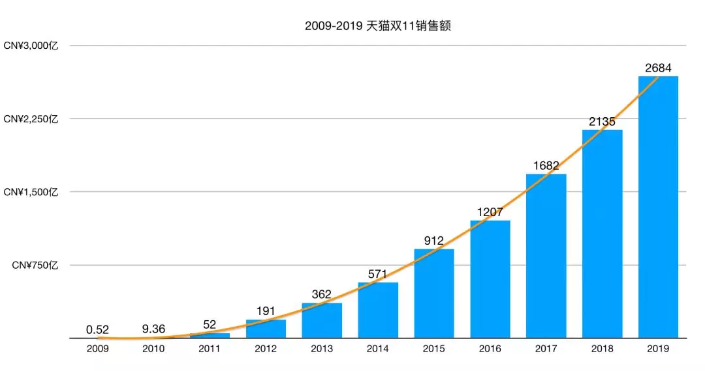

# 云服务的下一个十年

美信拓扑 _2019-12-21 21:50_

以下文章来源于一乐来了 ，作者一乐

[

**一乐来了**.

专业聊 IM 和架构，偶尔聊管理与成长，互联网创业中

](https://mp.weixin.qq.com/s/o-yyoIgsqIh8GV6LBhucWQ#)

## **0\. 序**  

  

双11过去了，天猫又拿出了一小时1000亿一天2684亿的惊人成绩，京东也达到了惊人的2044亿。真是一个电商狂欢的季节。

  

不过这个节日并不只有狂欢。尤其是对身在其中的技术人来讲，感受更多的的恐怕是还是一种爱恨交织的复杂心情。

  

爱它，因为这是多少人梦寐以求的挑战，一身所学终于要有用武之地；恨它，因为在惊人的销售额背后，是巨大的网络吞吐和极端的访问峰值，足以让挡在前面的任何系统都有随时垮掉的风险。

  

  

很多人都会记得，这场起源于十年前的商业促销，即使在最开始规模不到现在百分之一的时候，也并不是一帆风顺的（文后参考链接1）。但十年之后面对曾经的百倍千倍访问量，居然还有意犹未尽之感（从社区的兴奋程度来看），不禁让人赞叹其背后的技术能力的增长。

  

我们现在也知道，这技术能力的增长，离不开背后云计算的助力。

  

  

  

## **1\. 云服务的浪潮**

  

  

  

我喜欢读历史，历史中有很多故事。那些或有趣或惨淡的故事，都在让过去的人和物变得丰满，让看的人不自觉地回看自身，思考当下和未来。

  

科技史里面印象深刻的是吴军老师的《浪潮之巅》，虽然确切地说，也许应该属于企业发展史一类。文中关于企业基因和产业浪潮的说法让人豁然开朗，因为不用仔细琢磨，也很容易在企业背后看到人的影子，天赋技能生老病死，有个性也有规律。

  

而一个个企业的诞生和成长，在社会的舞台上你方唱罢我登场各领风骚，也便形成了这后浪推前浪的行业发展浪潮。

  

所以当我们说浪潮，某种程度上，也是在说行业的变迁。

  

今天我们说的是云服务，这个云服务，包括基础设施IaaS、技术平台PaaS和应用服务SaaS。

  

  

## **2\. 过去的十年**

  

Cape Town, Photo by Douglas Bagg on Unsplash

  

2004年底的时候，亚马逊IT部门的 Chris Pinkham 跑到南非开普敦，带领团队开始着手开发亚马逊的AWS的第一个产品，来实现「把基础设施当做一种服务卖出去」的点子，一个讨论了近一年的念想。这个产品就是我们后来熟知的弹性云计算 Elastic Compute Cloud，也就是EC2（参考链接2）。

  

两年后的2006年3月14日，这个服务连同S3和之前发布的SQS一起正式推出，受到众多初创公司的欢迎，亚马逊也因此开始了引领商业计算领域的十年光辉路。为什么叫引领？即使看2018年Q3的数据，AWS在云计算行业里仍是当之无愧的老大，市场份额比老二老三老四老五加起来还要多2%，即使后四位的市场份额之和已经高达32%。

  

AWS宣布进入中国已经是七年后，这也给了他的中国学生阿里云充足的时间成长。实际情况是，阿里云根本不需要这么长时间，2011年7月开始已经可以大规模对外提供云计算服务了。

  

  

  

以2011年为界，刚好把我的工作经历分成了两半。让我有足够的时间体会自己采购服务器、安装操作系统、调整网络然后上线服务的艰难与繁复，也让我有足够的时间来观察这个转变，观察这个云服务带来的行业变革。

  

如果说十多年前，开展新业务的说要用云计算还只是一个炫酷到天真的想法的话，十多年后的今天，人们的思维已经完全逆转，从初创公司到一线互联网巨头无一例外。自行采购服务器搭建机房已经是另类的选择，而且必然受到各方的关怀和疑问。

  

因为云计算实在是太方便了。只要代码开发完，可以分分钟完成服务的部署上线，极大降低了业务的试错成本。同时，资源使用完全是按需配置，不再担心服务器资源准备不足引发的服务容量不足，也不再担心业务峰值过后的资源浪费。

  

一手时间，一手金钱，就像一个才华与美貌并存的美女，让任何业务都无法拒绝。

  

试错成本的降低大大增加了应用创新的可能性，这无数的可能性制造了更多的成功机会，促进了业务与应用的发展，进而给技术和服务带来了更多的需求。需求的增长意味着资源投入的再次增加，可以进一步支撑技术不断演进。而越来越完善的技术，又会吸引越来越多的业务采用。

  

  

一波一波的创新业务，一次又一次的技术服务演化，催动了这个属于云服务的浪潮。  

  

  

  

  

2018年3月24日，Dropbox上市，5亿多注册用户，超过1100万付费用户。

  

故事还要从2006年冬天说起。11月的一天，Drew Houston要去纽约，但当他在波士顿南站准备坐车的时候，才意识到把装资料的U盘忘在了公寓里。这激发了他的灵感，在随后旅途的四个小时里，Dropbox的原型便开始开发了。此后，Drew 通过 Hacker News 的宣传、进入Y Combnator 孵化，一步步成长为硅谷明星企业（参考链接3）。

  

它的创业故事很精彩，不过不是今天我们关注的重点。我们关注的是在这精彩的背后的 Dropbox，作为一个文件管理服务，将真正的文件内容存储在了亚马逊的 S3 服务上，至少在开始的八年里（参考链接4）。

  

  

当然，这个世界是平行的，每一时每一刻都有不同的故事在发生着。

  

  

  

  

  

2007年，Chris Wanstrath 走进 Zeke，一个位于旧金山的体育酒吧。遇到了在里面的 Tom Preston Werner 。后者一反常态，并没有跟他扯淡，而是正经地说，他想建立一个专属于程序员的社交网站，一个可以在上面分享代码的网站（参考链接5）。

  

这就是后来被戏称全球最大基友社交平台的Github。

  

两年之后，因为不堪忍受公司内部SVN的低效，我开始使用Git，也开始尝试提交一些小玩意儿，但在彼时，其实并没有多少人觉得会把代码放到一个第三方平台去托管。

  

十年后的2018，它被收购的时候，已经有2700万用户，无数的项目在上面开花。Github 搭建在 Rackspace Cloud 上，AWS之外的另一家 IaaS 云服务商（参考链接6）。

  

  

这样的故事不胜枚举，相信已经没多少人会怀疑云服务浪潮的到来，而是开始思考，这个浪潮到底有多大，又能持续多久了。

  

  

  

## **3\. 技术服务的未来**

  

  

  

2007年我开始工作，做 Jabberd2 上的二次开发，一个C语言的 XMPP 服务器。然后就陆陆续续有朋友找过来，希望做一套即时通讯IM，出价十万。等到2014年我们开始做即时通讯云服务，自己研发的通讯协议，源码授权的价格已经变成了百万级别，但是同时你却可以租用云服务，只需要一万块一年。

  

  

在十万、百万和一万的中间发生了什么？

  

  

首先是一个让人不那么开心的事实，技术贬值了。

  

虽然没有摩尔定律的节奏，但这确是事实。今天你依然可以根据开源的 XMPP 服务改造一套 IM 软件出来，那些开源的服务器和客户端都要比十年前更稳定和成熟，一套随便组装的系统再也卖不出十万块。

  

再考虑到人力成本已经大增，原来应届毕业生3、5K的月薪，现在已经涨了三五倍的情况，贬值就更厉害了。

  

  

与此同时，好的方面是，需求也增加了。

  

原来买源码，对系统也没有什么额外的要求，高并发高可用扩展性也不考虑，能跑起来就行。现在互联网用户激增，不需要太多远见，一个业务也需要考虑到未来的增长，可能是百万级、千万级同时在线。

  

移动互联网的普及，也促使业务考虑全平台的策略，移动端 iOS 和 Android 是要支持的，大多数情况还要优先于 PC 和 Web，甚至你还要可能支持H5和微信的小程序。

  

  

这些是十万到百万变化的原因，但只是一个开始，更关键的还是后面，百万到一万的变化。

  

我们看今天的市场，对于初创企业来讲，不再只有自研 IM 系统一个选择。他可以也租赁公有云服务，分分钟享受最新的最成熟的技术成果。对于 IM 涉及的所有功能，也可以部分选择，让拥有服务的整体成本更低。

  

这就是我想说的第三点，需求细化的同时，也分级了。让分级的需求得到满足，让选择从可能变为现实，就是云服务带来的变化。

  

不同于聊天这样的功能/业务技术，实现云服务的技术，提高的是技术服务的效率。作为前者的倍增器，降低服务交付的边际成本，为规模化带来了可能。原来你只能服务几家客户，现在却可以服务几十万家，甚至百万千万家。即使这千百万家，原本可能并不会也没有预算来尝试使用服务。

  

当技术升级带来了效率的提升，而效率提升使得服务商可以轻松支撑大规模的客户的时候，必然会带来市场的改变甚至重构。  

  

  

这也是互联网规模经济的原理所在。

  

而借助服务化带来的边际成本递减，服务的质量也确实在不断提升。技术服务已经从原来「用我你能做什么」变成了「我能为你做什么」，从原来的「我是一把螺丝刀」变成了「我能为你拧螺丝」。

  

这种变化，正在云服务浪潮下普遍而广泛地发生。在IaaS层，基础设施正从以计算为中心，向服务为中心转变；在PaaS层，平台从以功能为中心，向服务为中心转变；而SaaS层，系统也开始从以业务为中心，向服务为中心转变。

  

我们欣喜于这种转变，因为为技术人员展开了一个光明的未来。而这个未来，对做文件存储的 Dropbox 是光明的，对做代码托管的 Github 是，对做即时通讯云的我们也是。

  

  

## **4\. 下一代的云服务**

  

  

前面介绍了 Dropbox 和 Github，我之所以写这两个，不仅因为他们是使用云计算基础设施的业务，因为他们自身就是云服务，还有一点很重要，它们都涉及了一个云服务里的重要议题：数据安全。

  

长期以来，数据安全是很多企业选用云服务的重要考量，他们担心数据一旦上了云，因为保管不当或者云厂商监守自盗，反过来危害了自己的业务。这个担忧，对于个别企业也许存在，但对大多数人来讲，还是因为对未知事物的恐惧。

  

不过要消除这种恐惧，并不是说说就可以的，还需要时间，需要一些技术上的适应和变化。

  

  

  

在过去的几年，很多云服务的厂商通过公有云，发现了大量这样的需求，转化未遂之余，只好开始销售私有云解决方案。虽然看起来提高了收入，然而却是把自己从云时代拉回了软件开发时代。

  

几乎所有的私有云，都在打着云的旗号，赚着软件开发的钱。大材小用的技术栈、丛生的适配问题，让私有云的运维成本居高不下，极大影响了服务质量和效率，让这些以速度见长的互联网企业越走越慢。大部分项目最终变成了厂商的金手铐。

  

  

从好的方面看，这样的私有云客户的普遍存在证明了云服务还有极大的发展空间，而他们中的一大部分最终会使用公有云或者专有云的。等到未来的某一天，他们看到云服务的效率和收益，要远大于增加的数据安全问题带来的风险的时候。

  

  

不过作为一名技术人员，身处云计算的浪潮之中，还是可以可以清晰地看到相关技术的快速发展。从虚拟化开始到容器化，从服务化到无服务，底层服务的效率仍在日新月异地变化。

  

容器技术的发展，已经可以抹平多数硬件设备的差异，而云原生技术的逐渐成熟，已经足以让私有化部署变得高效。一个多云架构的平台，有机会从根本上提高私有云和专有云的服务效率，降低私有云和专有云的的成本，从而再次利用规模效应改变私有云的市场。

  

  

  

这就是我们做美信拓扑的原因，这个多云架构的即时通讯云服务，现在已经出来了。欢迎各位试用下载，一键安装你的即时通讯私有云，有免费规格可以玩哦😜

  

不过限于篇幅，技术架构方面的内容只能以后再讲，感兴趣的话请持续关注本号，也可以搜索关注「美信拓扑」公众号。

  

  

  

## **5\. 后记**

  

  

那十年之后的云服务是什么样子？

  

只要时间的迷雾不散，我想我们都只能猜测，在技术的涌现和行业的变化中，寻找草蛇灰线的走向。这是一件很难的事情，但并不是我们放弃思考判断未来的理由。因为变化一定在发生，你只是没有看到而已。

  

如果今天像昨天一样，为什么会跟十年前不太一样？

  

  

关注「一乐来了」，一起再聊个十年

  

  

  

## **参考链接**

  

1.  阿里云与天猫双11这十年 
    
    https://yq.aliyun.com/articles/669041
    
2.  亚马逊改变格局的云服务是由南非的一票人构建的
    
    https://www.businessinsider.com/amazons-game-changing-cloud-was-built-by-some-guys-in-south-africa-2012-3
    
3.  Dropbox 埋葬硬盘的内幕
    
    https://www.wired.com/2013/09/dropbox-2/
    
4.  Dropbox 撤离亚马逊云帝国
    
    https://www.wired.com/2016/03/epic-story-dropboxs-exodus-amazon-cloud-empire/
    
5.  Github创始人：我如何放弃30万美元年薪创业
    
    http://tom.preston-werner.com/2008/10/18/how-i-turned-down-300k.html
    
6.  为什么 Github 用 Rackspace 而不用 Amazon EC2
    
    https://www.quora.com/Why-did-GitHub-use-Rackspace-over-Amazon-EC2
    
7.  美信拓扑：一键启用多云架构的即时通讯云服务
    
    https://www.maximtop.com/