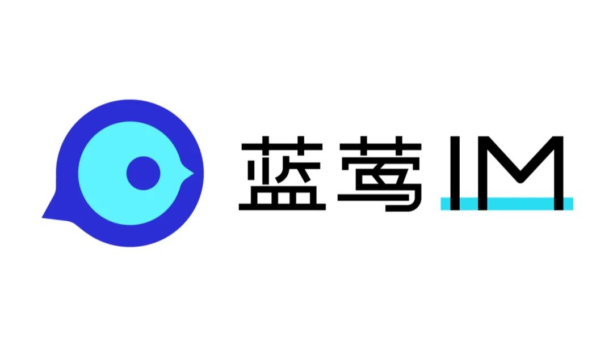
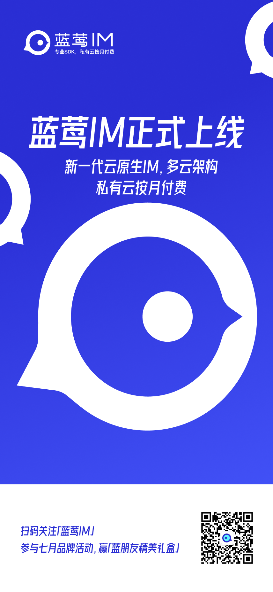

# 未来在非洲，每出货两台智能手机就有一台使用蓝莺 IM 的技术

小蓝会聊天 蓝莺IM _2022-07-21 08:24_

> 美信拓扑正式发布 IM 云服务新品牌「蓝莺IM」。
> 
> **这只小鸟刚出生，就要飞越撒哈拉沙漠了！**
>

经过半年的筹备，设计、代码和文档的修改和APP改版，和意料外的商标、公众号认证等细节，「蓝莺IM」终于上线了。🎉🎉🎉  

  

从今天开始，「美信拓扑IM」正式升级为「蓝莺IM」，官网启用新域名 [www.lanyingim.com](https://www.lanyingim.com) ，原域名 [www.maximtop.com](https://www.maximtop.com) 作为备用保留。

新Logo原型是辉蓝细尾嘹（liáo）莺，一种生活在澳洲的天性浪漫的小蓝鸟。你可以在[这里](https://ebird.org/species/splfai1)看到它非常可爱的照片。

这次升级已经有好多朋友关心，刚好借此机会介绍一下我们近况，蓝莺IM过去的一些工作。

## 1. 手机上哪里使用蓝莺IM的技术

  

受苹果 iPhone 启发，所有的安卓手机厂商都会考虑基于短信应用构建自己的类 iMessage 应用，通过「短信+IM」双通道模式，为用户提供高效经济的通讯体验，蓝莺IM可靠稳定，因此成为 IP 通道通讯的选择。

蓝莺IM技术已经被多家手机厂商采用，专有云非洲区域也已开通，出海非洲的企业 已经可以在 APP 里直接集成聊天功能。截止目前，综合智能手机市场占有率公开数据统计，**在非洲地区，每两台新出货的智能手机里就有一台使用了蓝莺IM技术**。

  
**全球范围内，每七台新出货手机中就将有一台使用了蓝莺IM技术。** 这个数字在很快的将来会继续变为四分之一，不过现在我们还是说回非洲。
  

## 2. 非洲市场验证助力蓝莺IM成为出海企业首选

一、非洲地区通信的仍处在发展阶段，且不同地区差异巨大。

根据 GSMA 的数据，2019年撒哈拉以南地区还处在 2G 时代到 3G 时代的过渡期，中东以及北非则处在 3G 到 4G 的过渡期。

> [南非(撒哈拉以南)地区仍处在 2G/3G 时代，2G/3G 覆盖率为 91%，4G 覆盖率仅为 9%，，预计到 2025 年 4G 覆盖率将提升至 27%，5G 覆盖率 也将增加到 3%;中东及北非地区正处在 3G 向 4G 转变的过渡阶段， 2G/3G 覆盖率为 71%，4G 覆盖率为 29%，预计到 2025 年 4G 覆盖率将 提升至 48%，5G 覆盖率将提升至 6%。](https://pdf.dfcfw.com/pdf/H3_AP202102181463022774_1.pdf?1613635462000.pdf)

2022年5月份，Strategy Analytics 发布的研究报告《撒哈拉以南非洲无线市场展望：运营商增长战略》指出：

> [撒哈拉以南非洲地区的4G网络仍处于起步阶段，目前仅占移动网络连接的不到四分之一，网络覆盖57%的人口，而城市中心以外的覆盖范围有限。](https://finance.sina.com.cn/tech/2022-05-19/doc-imcwiwst8168322.shtml)

因此在该地区运行即时通讯（ IM ）服务需要更多考虑来兼容各代网络的不同情况，使用不同的超时和传输策略来保证通讯可靠进行。  

二、非洲地区和我国不同，每个运营商的通讯覆盖网络非常小，运营商非常之多，与此同时，不同运营商之间收费也不同，一跨网价格就高。因此多卡多待在手机上成为潮流。

这也就意味着，手机网络通讯可能随着切换走完全不同的链路，这增加了消息乱序的风险，因此需要 IM 系统充分应对各种边缘场景，比如增加重复检测以保证投递有序和唯一。  

**经过非洲市场验证的蓝莺IM，将会为非洲出海以及全球其他发展中地区的应用提供可依赖的专业即时通讯云服务。**

## 3. 新一代云原生IM，新一代多云生态

不同于传统 IM 云厂商，蓝莺IM积极参与各厂商的生态建设。

而作为新一代云原生IM，同时受益于多云架构，原来复杂的系统搭建过程已经实现完全自动化，自动安装、配置、测试，所有过程仅需十分钟左右。

因此我们得以入驻各家 IaaS 厂商，当前已经上线的有阿里云云市场、青云APPCenter、亚马逊云科技中国市场、AWS Global Marketplace，同时与七牛、UCloud、西云数据等也建立了深入合作。

**云原生设计其实主要在解决一个问题，即云服务厂商是否可以通过一套设计同时服务公有云和私有云客户。**  

我们当前有客户的私有云集群已经运行了近两年，充分证明了我们多云设计的可行性，即让客户像使用 Office 软件一样使用一套即时通讯系统，部署简单维护方便。

此外，私有云客户的最大需求是定制。我们作为 IM 云平台，由于系统分层以及API设计的通用性，可以避免大部分定制需求。但我们理解上层应用对定制的需求，也因此，我们未来会将多云架构以及制品管理开放给上层应用，让使用蓝莺IM的 SaaS 应用都可以变成云原生应用，让他们也可以做到快速分发，立即部署。

这便是我们多云生态建设的第二部分，**赋能所有接入蓝莺IM的上层应用，让它们可以直接进入云原生时代。**

## 4. 蓝莺IM私有云是系统集成商的利润来源

如上所述，借助于云原生技术，蓝莺IM私有云的成本得以大幅降低，也因此**将 IM 私有部署的价格做到原来市场价格的百分之一。**

前几天又有朋友来问定价如此之低，那岂不是赚不到多少钱，市场也要乱了？我告诉他，原因很简单，云原生是未来，是必然，我们今天如果不这样定价，看起来可以在某个项目上赚到多一点的钱，但依然逃不掉被后来者以百分之一的价格攻击。

而到那时，我们也将处于非常被动的状态，也会跟当前市场上其他家云厂商的状态一样无法降价，技术升级迭代负担重不说，从销售到公司业务都无法接受的改变。销售不能接受。因为同样的项目提成少了（接近于过去的零头），公司业务无法接受是因为收入少了。

**模式转变要求组织先能改变，这是来自康威定律的魔咒。如果你基于一种定价模式走起来了，后面是很难调整的。**

同时我们当前的定价并不影响**拿到客户预算的系统集成商**，相反的是，**他们可以借此大幅提高利润**。因为预算一般是根据行业价格定价，我们的百分之一价格相当于降低了他们的成本，预算在手，剩下的99%的预算都将是利润。  

也因此我们相信，在越来越多企业开始注重效能和TCO的后疫情时代，蓝莺IM私有云将会变成系统集成商的首选。  

要了解更多定价的内容，请继续阅读《[SaaS定价二：按月付费的私有云](saas-pricing-two-monthly-private-cloud.md)》

## 5. 蓝莺IM已开源代码 163277 行

蓝莺IM正在逐步开源，当前开源的代码主要涉及各客户端 Demo 源码以及部分 SDK 源码，截止到上次统计（2021.08），已开源代码 163277 行。更多信息，参见[蓝莺IM开源计划 LIMOS](https://github.com/maxim-top/maxim-bistro/blob/master/LIMOS.md)。

## **蓝朋友计划的最新情报**

> 我们正在以蓝莺IM开源项目为基础，打造一个专业的即时通讯技术社区，这便是我们的「蓝朋友计划」。此计划将会邀请社区技术专家一起，共同分享关于即时通讯（IM）技术相关内容，欢迎持续关注，也欢迎自荐或推荐参与。  
>
> 另外，微博关注 @蓝莺IM，参与文章转发，有机会获得「蓝莺IM礼盒」哦~

