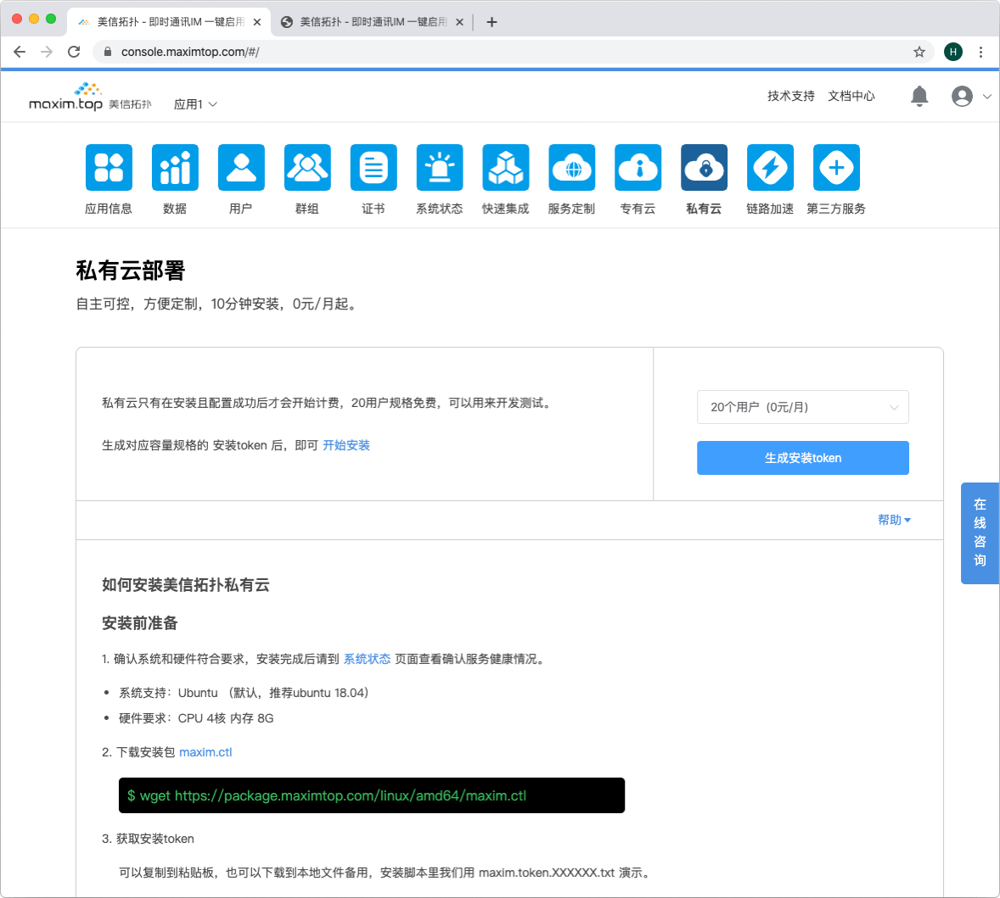
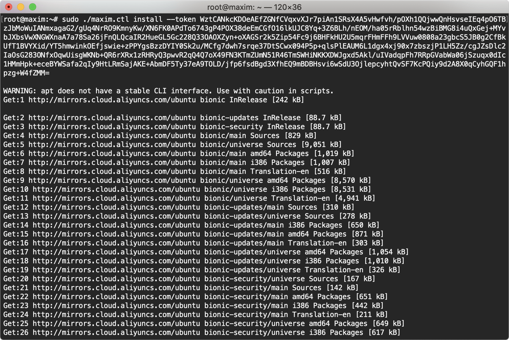
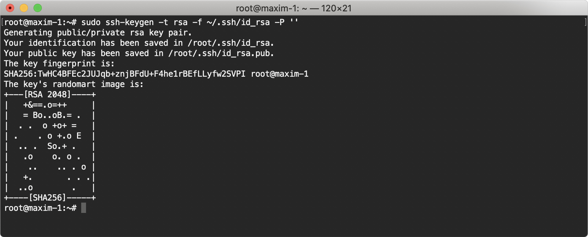
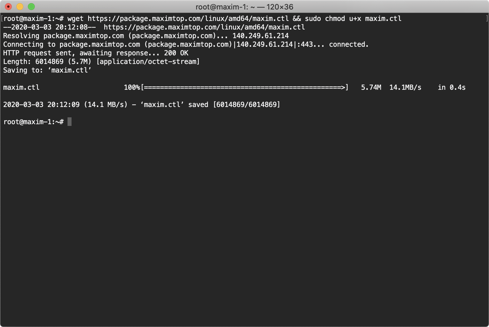
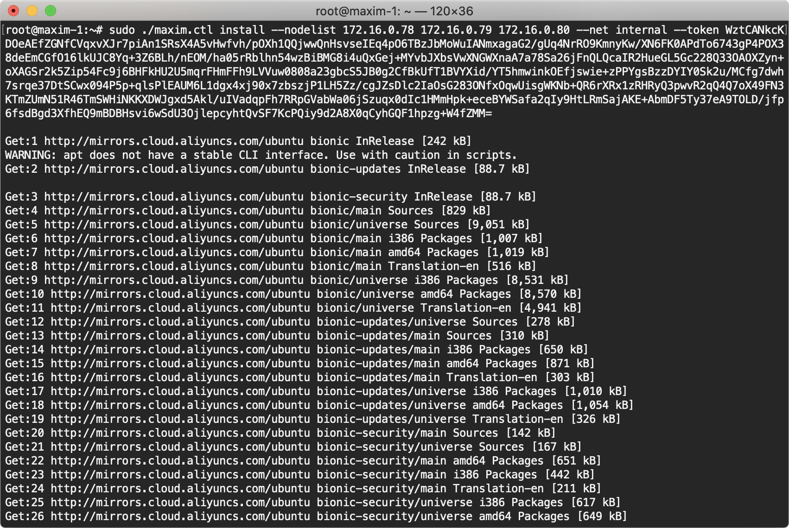
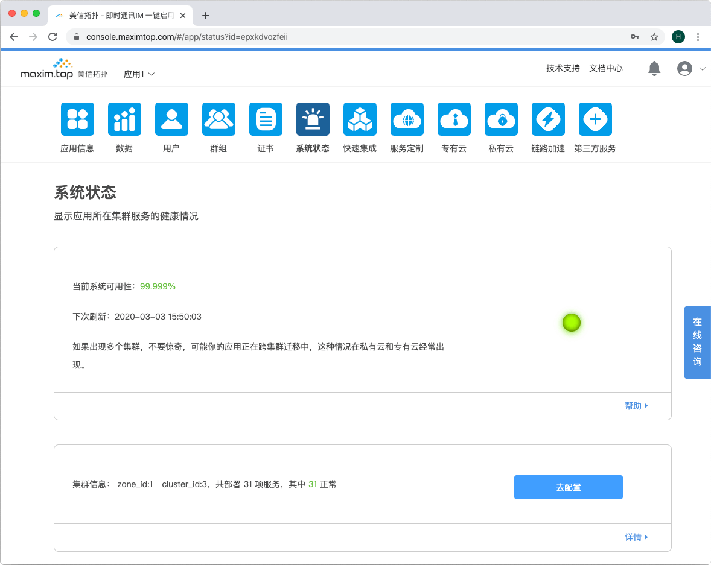

# 私有云部署文档

## 概述

美信拓扑私有云可以一键安装，省心高效。使用私有云，你将完全掌控你的数据和服务，并毫无限制地访问所有服务。

借助于最先进的容器技术，美信拓扑所有的服务有已完成云原生改造，这是私有云可以稳定可靠地运行在从裸机服务器、私有云计算平台到各种内部容器平台环境中的重要依靠。

美信拓扑私有部署提供两种部署模式：单机版和集群版。三步操作，十分钟安装，控制台提供了简洁的状态监控页面，系统运行状态实时掌控。

## 创建应用

[登录控制台](https://console.maximtop.com) 点击创建应用。应用创建默认为免费版套餐，也可以升级为商业版。

.png>)

## 开通私有云服务

1.应用创建成功后，进入应用详情页面。

.png>)

2.点击更改计划，选择私有云，点击“继续”。


3.点击私有云图标，进入私有云详情页面，下载安装包 maxim.ctl

```
$ wget https://package.maximtop.com/linux/amd64/maxim.ctl
```



4.获取安装token。可以复制到粘贴板，也可以下载到本地文件备用，安装脚本里我们用 maxim.token.XXXXXX.txt 演示。


## 安装私有云

安装准备

* 操作系统：

> Linux 推荐 Ubuntu 18.04 或 CentOS 7/8 树莓派 推荐 Ubuntu 18.04 rasp3 MacOS 推荐 Catalina 10.15

* 硬件配置：

> CPU 4核 内存 8G 硬盘100G

* 如果选择安装集群版， 需要3台或更多服务器
* 下载安装包 maxim.ctl

### 单机版

1.首先，准备好一台用来私有部署的服务器，将ssh登录到这台服务器上。 然后，执行下载安装脚本命令，并增加可执行权限。命令如下：

```
wget https://package.maximtop.com/linux/amd64/maxim.ctl && sudo chmod u+x maxim.ctl
```

执行结果截图：


2.运行安装

* 安装服务器已有公网IP，执行如下命令开始安装。

```
sudo ./maxim.ctl install --token INSTALL_TOKEN
```

注意：提示“Enter maxim install token:”，请输入已复制的安装Token，继续执行安装。

开始执行的截图：



安装完成的截图：


* 本地环境不可进行外部访问，安装时需要添加参数 --net internal 提示安装程序选择内网IP注册。

执行如下命令开始安装

```
sudo ./maxim.ctl install --net internal --token INSTALL_TOKEN
```

提示：安装脚本会提示“Enter maxim install token:”，请输入已复制的安装Token，继续执行安装。

开始执行的截图：


安装完成的截图：


提示：等待安装完成，耗时15分钟左右，即可安装完成。

### 集群版

1.配置集群访问权限

配置第一台主机对其余主机的ssh权限，以三台主机 172.16.0.78 、172.16.0.79 、172.16.0.80 为例。

ssh登录master节点（172.16.0.78）

执行如下命令,生成ssh用的公私钥：

```
sudo ssh-keygen -t rsa -f ~/.ssh/id_rsa -P ''
```

执行结果截图：



执行如下命令, 将命令的输出分别在主机172.16.0.78 ，172.16.0.79 ，172.16.0.80上执行

```
sudo echo "sudo echo \"`cat ~/.ssh/id_rsa.pub`\" >> ~/.ssh/authorized_keys"
```

命令输出结果截图：


命令输出在172.16.0.78的执行结果：


命令输出在172.16.0.79的执行结果：


命令输出在172.16.0.80的执行结果：


2.ssh登录到第一台主机172.16.0.78上 执行如下命令下载安装脚本，并增加可执行权限

```
wget https://package.maximtop.com/linux/amd64/maxim.ctl && sudo chmod u+x maxim.ctl
```

执行结果截图：



* 服务器已有公网IP，执行如下命令开始安装。

```
sudo ./maxim.ctl install --nodelist 172.16.0.78 172.16.0.79 172.16.0.80 --token INSTALL_TOKEN
```

提示：安装脚本会提示“Enter maxim install token:”，请输入已复制的安装Token，继续执行安装。

开始执行的截图：


安装完成的截图：


* 本地环境不可进行外部访问，安装时需要添加参数 --net internal 提示安装程序选择内网IP注册。

执行如下命令开始安装。

```
sudo ./maxim.ctl install --nodelist 172.16.0.78 172.16.0.79 172.16.0.80 --net internal --token INSTALL_TOKEN
```

提示：安装脚本会提示“Enter maxim install token:”，请输入已复制的安装Token，继续执行安装。

开始执行的截图：



安装完成的截图：


提示：等待安装完成，耗时20分钟左右，即可安装完成。

### 阿里云版

单机版和集群版支持使用阿里云的redis/rds/kafka/oss，如果需要使用可以在单机版和集群版步骤2的install命令之前执行如下命令：

* 使用阿里云redis做存储

```
## redis-server为redis的服务地址， redis-password为redis的密码
sudo ./maxim.ctl set_config --config redis-server=r-xxx.redis.rds.aliyuncs.com:6379 redis-password=xxx
```

* 使用阿里云redis做缓存

```
## redis-cache-server为redis的服务地址， redis-cache-password为redis的密码
sudo ./maxim.ctl set_config --config redis-cache-server=r-xxx.redis.rds.aliyuncs.com:6379 redis-cache-password=xxx
```

* 使用阿里云rds

```
## mysql-server为rds的服务地址， mysql-username为rds的用户名, mysql-password为rds的密码
sudo ./maxim.ctl set_config --config mysql-server=rm-xxx.mysql.rds.aliyuncs.com:3306 mysql-username=xxx mysql-password=xxx
```

* 使用阿里云kafka

```
## kafka-server为kafka的服务地址，kafka-user为kafka的用户名， kafka-password为kafka的密码
sudo ./maxim.ctl set_config --config kafka-server=172.16.1.10:9092,172.16.1.9:9092,172.16.1.11:9092 kafka-user=xxx kafka-password=xxx
```

* 使用阿里云oss

```
## file-storage-access-key-id为阿里云子账号ID
## file-storage-access-key-secret为阿里云子账号密码
## file-storage-access-endpoint为阿里云接入点地址
## file-storage-bucket-chat-file为阿里云OSS的bucket名字
## file-storage-bucket-user-profile为阿里云OSS的bucket名字
## file-storage-bucket-chat-history为阿里云OSS的bucket名字
## file-storage-bucket-chat-file-chatroom为阿里云OSS的bucket名字
sudo ./maxim.ctl set_config --config file-storage-type=oss file-storage-access-key-id=xxx file-storage-access-key-secret=xxx file-storage-access-endpoint=oss-cn-beijing.aliyuncs.com file-storage-bucket-chat-file=chat-xxx file-storage-bucket-user-profile=profile-xxx file-storage-bucket-chat-history=history-xxx file-storage-bucket-chat-file-chatroom=chat-file-chatroom-xxx
```

## 其他注意事项

1. 服务安装完会需要联系服务器自检，如果确定本地环境不可进行外部访问，安装时需要添加参数 --net internal 提示安装程序选择内网IP注册。
2. 如果机器有防火墙，需要保证端口443和80允许访问。
3. 如何查看私有云安装进度，以及数据迁移状态？


1. 安装完成后，打开美信拓扑控制台进入系统状态页面。


